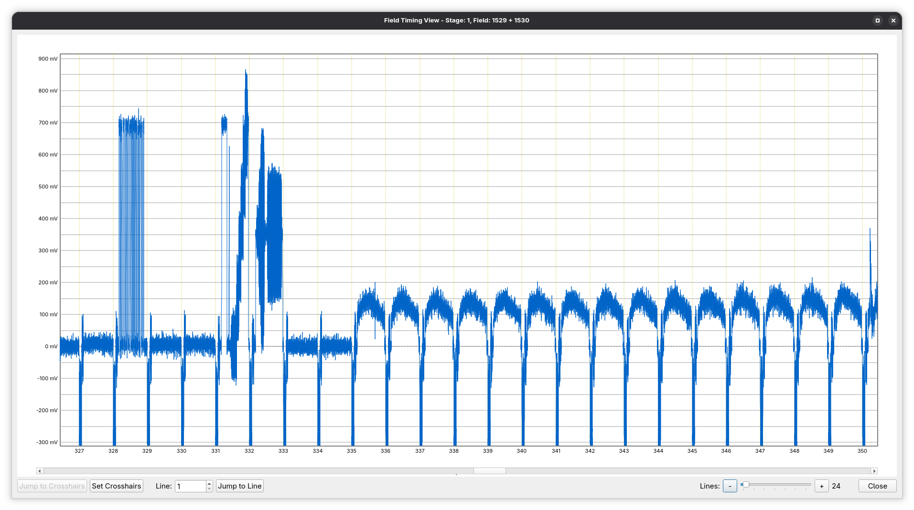

# Field Timing

The Field-timing dialogue is a **diagnostic tool** used to inspect **temporal structure and continuity at the field level** within a decode-orc pipeline. Like Preview and Line-scope, it is not a pipeline stage, but a **read-only analysis view** that attaches to preview-capable stages.

The Field-timing dialogue focuses on **when fields occur and how they relate to one another**, rather than how they look. It is primarily concerned with cadence, continuity, alignment, and metadata hints that describe timing.

---

## Purpose and use cases

The Field-timing dialogue is used to:

* Verify field order and parity continuity
* Inspect dropped, duplicated, or skipped fields
* Validate alignment between multiple sources
* Diagnose cadence issues (e.g. irregular field progression)
* Confirm correct behaviour of field re-mapping and alignment stages

It is especially useful when working with:

* Multiple captures of the same material
* Pipelines using `field_map` and `source_align`
* Stack-based workflows
* Sources with known timing instability or capture errors

---

## Attaching the field-timing dialogue

The Field-timing dialogue attaches to the **currently previewed stage** and analyses the **post-stage output stream**.

All timing information shown reflects:

* Upstream transforms
* Field reordering
* Alignment offsets
* Parity inversion or correction

---

## Core concepts

### Field index

Each output field is identified by a **zero-based field index**, corresponding to the index used throughout the pipeline.

If fields are reordered or dropped upstream, the field indices shown here reflect the **effective output ordering**, not the original capture numbering.

---

### Field parity

Each field carries a parity hint:

* First field
* Second field

The dialogue visualises parity progression across time, making it easy to spot:

* Incorrect parity flips
* Repeated parity
* Effects of the `field_invert` transform

---

### Field continuity

The dialogue tracks continuity of fields over time, highlighting:

* Missing fields
* Duplicated fields
* Unexpected jumps in source field references

This is critical for diagnosing issues introduced by capture errors or incorrect range mapping.

---

## Visualisation and indicators

The Field-timing dialogue presents a **timeline-style view** of fields.

Typical elements include:

* Sequential field indices
* Parity markers per field
* Source-origin indicators (where applicable)
* Alignment offsets or discontinuity markers

Visual cues are used to flag anomalies, such as breaks in expected progression.

---

## Interaction with transform stages

The Field-timing dialogue reflects the effects of timing-related transform stages directly.

### Field Map

After `field_map`, the dialogue shows:

* Reordered field indices
* Gaps where ranges were omitted
* Non-monotonic source field references

This allows immediate verification that range specifications behave as intended.

---

### Source Align

After `source_align`, the dialogue shows:

* Aligned starting points across sources
* Dropped leading fields
* Enforced first-field alignment (when enabled)

This is the primary tool for confirming that multiple inputs are correctly synchronised before stacking.

---

### Stacker

After `stacker`, the dialogue shows:

* A single, unified field timeline
* Stable parity progression (assuming aligned inputs)
* Absence of per-source discontinuities

It is useful for confirming that stacking did not introduce timing artefacts.

---

## Typical workflows

Common uses of the Field-timing dialogue include:

* Verifying field order immediately after a source stage
* Confirming correct behaviour of `field_map` range specifications
* Validating multi-source alignment before stacking
* Diagnosing parity issues observed in preview output
* Comparing timing behaviour before and after transform changes

---

## Limitations

* The Field-timing dialogue is read-only and non-destructive.
* It does not display sample-level or image-level data.
* Interpretation assumes that upstream metadata (VBI, timecode, parity hints) is present and valid.

---

## Notes on field-timing analysis

* The dialogue always reflects the **current preview stage output**.
* Timing anomalies shown here often explain visual artefacts seen in Preview.
* For best results, use the Field-timing dialogue together with Preview and Line-scope.

The Field-timing dialogue provides essential visibility into the temporal correctness of decode-orc pipelines, complementing visual and waveform-based inspection tools.
