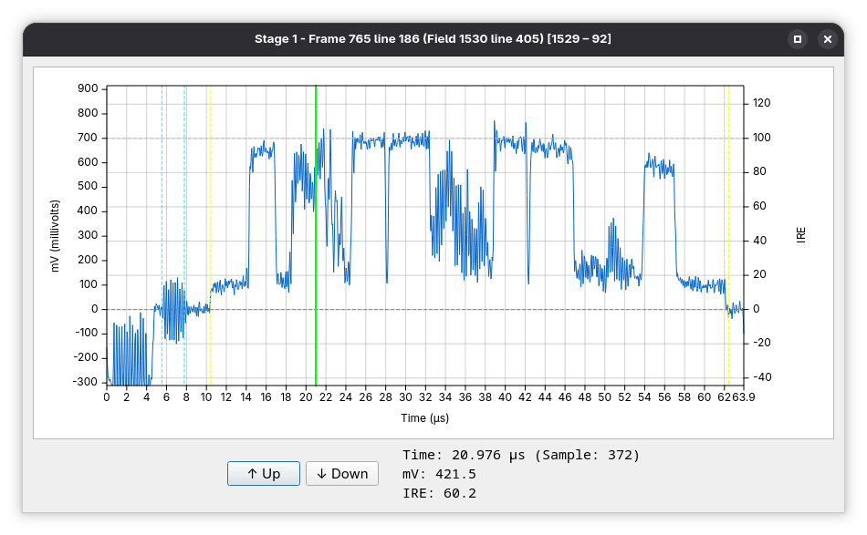

# Line scope

The Line-scope is an **interactive signal inspection tool** within decode-orc that allows detailed examination of **individual video lines at the sample level**. Like the Preview dialogue, it is not a pipeline stage, but a **UI analysis tool** that attaches to preview-capable stages.

The Line-scope is primarily intended for **low-level signal analysis**, making it possible to inspect timing, levels, noise, burst structure, and dropout behaviour with precision that is not possible from image-based preview alone.

---

## Purpose and use cases

The Line-scope is used to:

* Inspect raw luma and chroma waveforms
* Verify black, white, and sync levels (IRE)
* Examine colour burst amplitude and phase
* Diagnose noise, ringing, or capture artefacts
* Validate dropout detection and correction behaviour
* Compare line data before and after transform stages

It is especially valuable when working with:

* Analogue captures
* LaserDisc RF-derived signals
* PAL/NTSC timing and level issues
* Dropout-heavy or marginal sources

---

## Attaching the line-scope

The Line-scope attaches to the **currently previewed stage** and reflects the same field and timing context as the Preview dialogue.

When active, it operates on:

* The currently selected field
* A single selected field line
* The post-stage output signal (including all upstream transforms)

---

## Core line-scope features

### Line selection

The user can select a specific **field line index** to inspect.

Key characteristics:

* Line numbering is **field-relative**
* Line indices reflect any upstream re-mapping or masking
* First/second field parity is respected

This makes the Line-scope suitable for inspecting:

* VBI lines
* Active video lines
* Masked or corrected regions

---

### Sample-level waveform display

The Line-scope displays signal amplitude **per sample** across the selected line.

The waveform typically includes:

* Sync tip
* Back porch
* Colour burst (if present)
* Active video region

Amplitude is shown in IRE-scaled units derived from the effective video parameters.

---

### Channel views

Depending on pipeline configuration and stage capabilities, the Line-scope may support viewing:

* Luma (Y)
* Chroma (composite or decoded)
* Combined signal (where applicable)

The exact available channels depend on the upstream stages and signal type.

---

## Interaction with transform stages

The Line-scope reflects **exactly what a downstream stage will see**.

Examples:

* After `video_params`, black/white level overrides are visible immediately.
* After `mask_line`, masked regions appear flattened at the mask IRE level.
* After `dropout_correct`, corrected samples can be inspected directly.
* After `stacker`, per-sample noise reduction effects are visible.

This makes the Line-scope ideal for validating the **numerical effect** of transforms.

---

## Dropout and correction inspection

When dropout hints are present, the Line-scope can be used to:

* Inspect the original corrupted samples
* Verify the extent of dropout regions
* Confirm that replacement data is reasonable
* Compare corrected vs uncorrected behaviour by toggling upstream stages

When `highlight_corrections` is enabled upstream, corrected regions appear clearly in the waveform.

---

## Timing and stability analysis

The Line-scope is frequently used to:

* Verify horizontal timing stability
* Inspect sync edge shape and jitter
* Check burst placement and consistency
* Compare timing between aligned sources

These checks are essential when diagnosing capture hardware issues or alignment problems.

---

## Limitations

* The Line-scope is read-only and non-destructive.
* Only one line can be inspected at a time.
* Performance depends on pipeline complexity and preview position.
* Some sink-only or hardware-output stages do not support line-scope attachment.

---

## Typical line-scope workflows

Common workflows include:

* Inspecting colour burst before and after chroma-related transforms
* Verifying black/white levels after `video_params`
* Examining dropout regions before applying correction
* Comparing stacked vs unstacked signal noise
* Diagnosing capture artefacts at the sample level

---

## Notes on line-scope usage

* The Line-scope always reflects the **current preview field and stage**.
* Line-scope analysis complements, rather than replaces, image-based preview.
* For accurate interpretation, ensure video parameters upstream are correct.

The Line-scope is a critical tool for decode-orc’s low-level, signal-focused workflows, providing visibility into the exact waveform data that underpins all higher-level processing.
