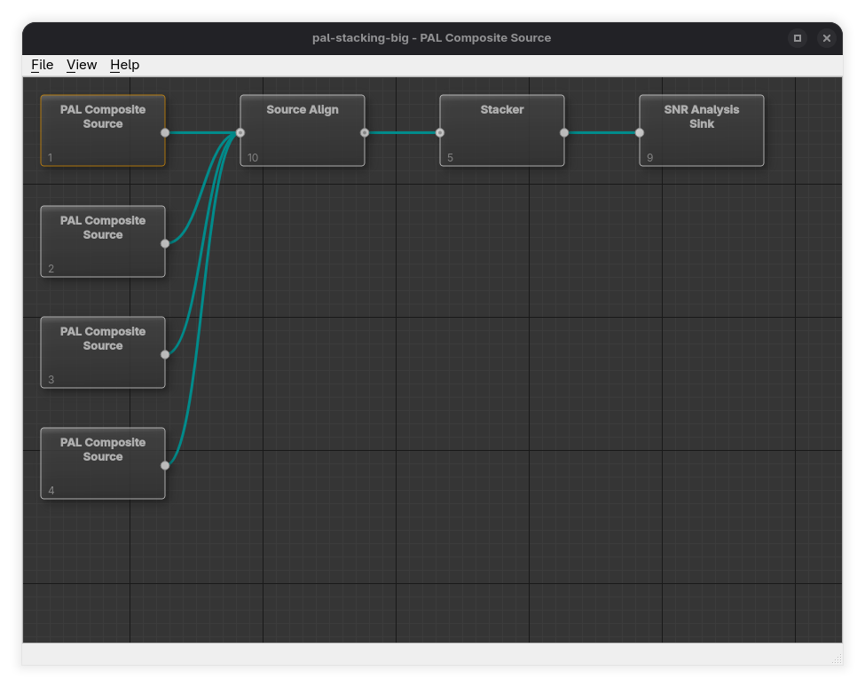

# Main window

The Orc-GUI main window contains:

* A **menu bar** (File / View / Help)
* A central **processing graph editor** where you build your pipeline using **stages** and **connections**
* A **status bar** that shows short messages about what the application is doing

---

## Menu Bar

### File Menu

#### New Project…

Creates a new, empty project.

When you choose **File → New Project…**, Orc-GUI asks you to select a project type:

* NTSC Composite
* NTSC YC
* PAL Composite
* PAL YC

A new project starts with an empty graph (no stages are added automatically). You add stages yourself in the graph editor.

#### Quick Project…

Creates a ready-to-run starter project from an existing capture.

When you choose **File → Quick Project…**, Orc-GUI asks you to select a video file:

* `.tbc` (composite)
* `.tbcc` / `.tbcy` (YC; requires both files as a pair)

Orc-GUI then looks for the associated metadata database alongside the file:

* `<base>.tbc.db`

If the metadata file is missing, the quick project cannot be created.

What Quick Project sets up for you:

* Detects whether the capture is **PAL** or **NTSC** from the metadata
* Adds the appropriate **source stage** for the detected system and input type
* Adds an **FFmpeg video sink** stage
* Creates a **connection** from the source stage to the sink stage
* If found, automatically attaches optional files next to the capture:

  * `<base>.pcm`
  * `<base>.efm`

After creating a quick project, you should usually:

* Open **Stage Parameters** on the sink stage and select an FFmpeg preset/output settings
* Use **File → Save Project As…** to save the new project (quick projects start “unsaved”)

#### Open Project…

Opens an existing `.orcprj` project file.

#### Save Project

Saves the current project.

If the project has never been saved before, Orc-GUI will prompt you to use **Save Project As…**.

#### Save Project As…

Saves the current project under a new filename.

#### Edit Project…

Edits project-level details (such as name/description). This is enabled only when a project is loaded.

#### Quit

Exits the application.

---

### View Menu

#### Show Preview

Opens the Preview window (if a project is loaded). This is where you can view decoded output for the currently selected stage.

#### Show Preview on Selection

A toggle.

When enabled, Orc-GUI automatically shows the Preview window when you select a stage in the graph editor.

#### Arrange DAG to Grid

Automatically lays out the graph in a tidy left-to-right grid based on stage order.

Use this when your graph becomes messy after adding or moving stages.

---

### Help Menu

#### About Orc GUI…

Shows version/about information.

---

## Graph Editor Basics

The graph editor is the central workspace where you build your processing pipeline using:

* **Stages** (boxes)
* **Connections** (lines between stage ports)

### Adding Stages

To add a stage:

* Right-click on empty space in the graph editor
* Choose **Add** (shown as “Add Node” in the menu)
* Pick a stage from one of the categories:

  * Source
  * Transform
  * Sink
  * Analysis Sink

Orc-GUI filters the available stages to match your project’s video system (PAL/NTSC). For source stages it also filters by input type (Composite vs YC).

The new stage is placed where you clicked.

### Creating Connections

To connect stages:

* Drag from an output port on one stage to a compatible input port on another stage

Connections represent the flow of data through your pipeline.

### Selecting Stages and Connections

* Click a stage to select it
* Click a connection line to select the connection

To select multiple items, use standard multi-select gestures (depending on platform):

* Hold **Shift** or **Ctrl/Cmd** while clicking additional stages
* Drag a selection rectangle on empty space to select a group

### Moving Stages

* Click and drag a stage to reposition it
* With multiple stages selected, dragging one typically moves the selection together

If the layout becomes hard to read, use **View → Arrange DAG to Grid**.

### Renaming a Stage

* Right-click a stage
* Choose **Rename Stage…**

This changes the label shown on the stage.

### Editing Stage Parameters

* Right-click a stage
* Choose **Edit Parameters…**

Use this to set file paths, decoding options, thresholds, output settings, and other stage-specific behaviour.

### Running Stage Tools (Analysis)

Some stages offer tools such as analysis and visualisation.

To access them:

* Right-click a stage
* Open **Stage Tools**
* Choose an available tool

If no tools apply to the selected stage, the menu will show that none are available.

### Inspecting or Triggering a Stage

Some stages can be inspected or triggered directly.

* Right-click a stage
* Use **Inspect Stage…** or **Trigger Stage** (if enabled)

If an action is unavailable, it is disabled and may show a tooltip explaining why.

---

## Zooming and View Navigation

### Zoom In/Out

* Use the mouse wheel over the graph editor to zoom

Zoom is intentionally limited (approximately **70% to 100%**) to keep stage rendering readable.

### Panning

Panning behaviour depends on platform and the underlying graph widget.

Common gestures include:

* Dragging the background with the middle mouse button
* Trackpad pan gestures

---

## Deleting Stages and Connections

### Deleting Connections

To delete a connection:

* Select the connection line
* Press **Delete**

### Deleting Stages

To delete a stage:

* Select the stage
* Press **Delete**

Important behaviour:

* Orc-GUI blocks deletion of stages that still have connections
* If you try, you will be prompted to disconnect all connections first

Alternative:

* Right-click a stage and choose **Delete Stage** (only enabled when the stage can be removed)