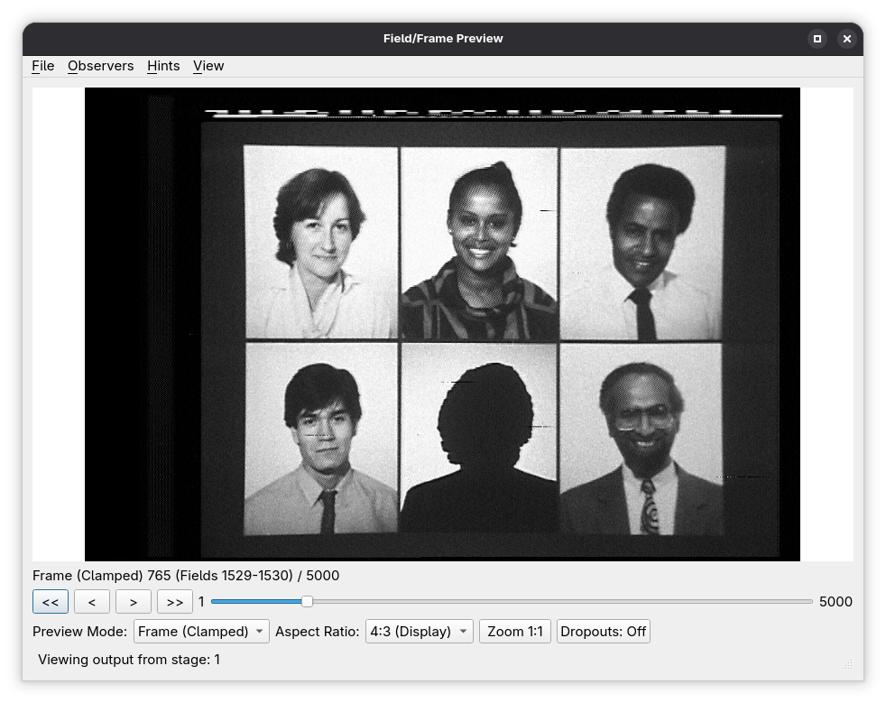

# Preview

The Preview dialogue provides **interactive visual inspection** of data flowing through a decode-orc pipeline. It is not a stage itself, but a **UI tool** that can attach to any stage that exposes preview support.

Previewing is intended for **validation, and tuning**. It allows you to verify timing, field order, signal integrity, and the effects of transform stages before committing to final outputs.

---

## Preview-capable stages

A stage supports preview if it implements the internal preview interface (commonly exposed in code as `PreviewableStage`). Most source stages, all transform stages, and some sinks support preview.

Preview support generally includes:

* Per-field image display
* Field stepping and scrubbing
* Parity (first/second field) indication
* Optional overlays generated by the stage

---

## Core preview features

### Field navigation

The preview dialogue allows navigation through the pipeline output **one field at a time**.

Supported controls include:

* Step forward / backward by field
* Jump to a specific field index
* Continuous playback (where supported)

Field indices always refer to the **post-stage output**, not the original source numbering.

---

### Field parity display

The preview UI indicates whether the currently displayed field is:

* First field
* Second field

This is derived from the field parity hints carried through the pipeline and is especially useful when validating:

* Field order correctness
* Effects of the `field_invert` transform
* Alignment after `source_align`

---

### Video scaling and rendering

Preview rendering uses decoded sample data and applies:

* Black and white levels (IRE-based)
* Active video region hints
* Aspect-correct scaling for display

This ensures the preview reflects how downstream sinks will interpret the signal.

---

## Stage-specific preview behaviour

Some stages augment the preview dialogue with additional behaviour or controls.

### Dropout-related stages

Stages such as `dropout_map` and `dropout_correct` may visually indicate dropout regions.

Examples include:

* Highlighted dropout areas
* White-filled correction regions (when enabled via parameters)

These overlays are generated by the stage and rendered by the preview UI.

---

### Masking stages

For stages such as `mask_line`, the preview will show masked regions directly in the rendered image, allowing immediate verification of:

* Line selection
* Parity-specific masking
* Mask level (IRE)

---

### Parameter override stages

Stages such as `video_params` affect how the preview is rendered by changing:

* Active video boundaries
* Black and white levels
* Burst and active region hints

The preview dialogue always reflects the **effective parameters after overrides**, making it a reliable validation tool.

---

## Preview limitations

* Preview is **non-destructive** and has no effect on pipeline output.
* Preview performance depends on stage complexity and pipeline position.
* Some sink stages (especially hardware sinks) may not support preview.

---

## Typical preview workflows

Common uses of the preview dialogue include:

* Verifying capture integrity immediately after a source stage
* Checking alignment after `field_map` and `source_align`
* Tuning `stacker` parameters while observing dropout behaviour
* Validating dropout correction before committing to final output
* Confirming active video and masking settings

---

## Notes on preview usage

* Preview always shows the output of the selected stage.
* When multiple branches exist, each branch can be previewed independently.
* Preview does not bypass or alter pipeline execution.

The Preview dialogue is an essential companion to decode-orc’s stage-based design, providing immediate visual feedback for pipeline construction, debugging, and validation.
