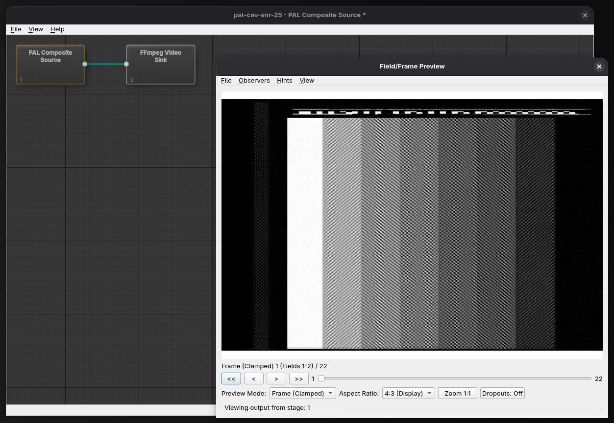

# Quick Projects

The Quick Project feature provides the fastest way to get started with decoding a TBC (Time Base Corrected) file. Instead of manually creating a new project and configuring all the settings, a quick project automatically sets up everything you need with just a few clicks or a single command.



### Using Quick Project in the GUI

#### Menu Option

- Open **File** → **Quick Project...**
- A file dialog will open asking you to select a video file
- Choose a `.tbc`, `.tbcc`, or `.tbcy` file from your system
- The application will automatically:
    - Detect the video format based on the file metadata
    - Create a new project
    - Configure the appropriate video system (PAL/NTSC) and source type
    - Add a source node and a sink node to process your video file
    - Open a preview window so you can view the video

### Loading a TBC from the Command Line

#### Using the `--quick` Option

To create a quick project from the command line, use the `--quick` flag followed by the file path:

```bash
orc-gui --quick /path/to/your/file.tbc
```

You can also pass a TBC file directly as an argument, and the application will automatically detect it's a video file and create a quick project:

```bash
orc-gui /path/to/your/file.tbc
```

The application supports the following video file formats:

- `.tbc` - Composite video files
- `.tbcc` - Composite video files with alternate encoding
- `.tbcy` - Y/C (component) video files

### Tips

- Quick projects are ideal for quickly previewing and analyzing video files without project setup overhead
- If you need to save your project for later, use **File** → **Save Project As** and give it a meaningful name
- All standard editing and analysis tools remain available after creating a quick project
