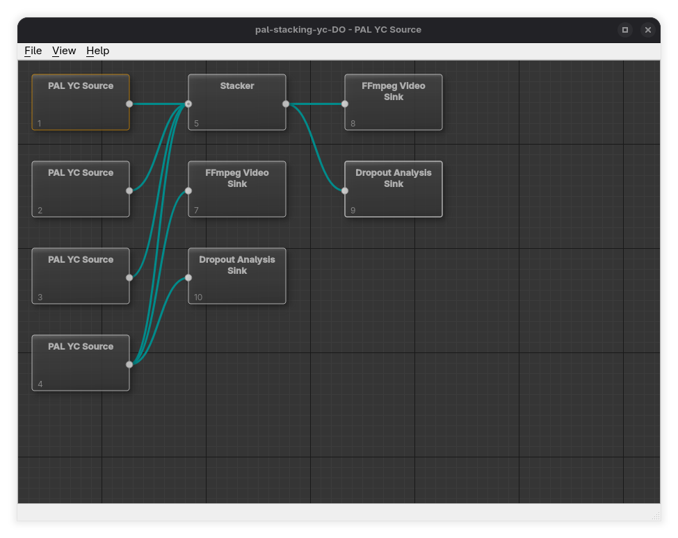

# Overview

A *stage* is a discrete processing unit with defined inputs and outputs. Stages are connected together to form a directed processing graph, where data flows along connections between stage outputs and stage inputs.  There are 4 stage types in decode-orc:

- Source stages are the **starting point of every decode-orc pipeline**. They load captured video (and any associated audio or data) from disk and make it available for further processing.
- Transform stages are where **most of the real work in decode-orc happens**. They take video from a source stage (or another transform stage) and modify, combine, or reinterpret it to improve quality or prepare it for output.
- Media sink stages terminate a pipeline by writing decoded or processed media/data to disk or external hardware.
- Analysis sink stages compute diagnostics and measurements and write analysis results to disk. They do not produce media streams.

