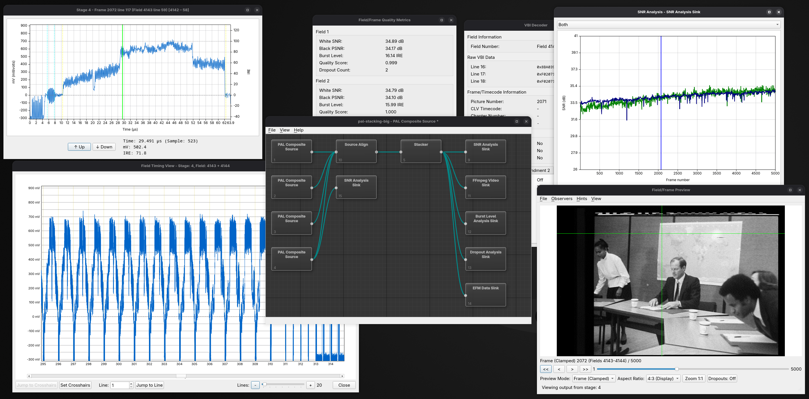

# Home

Welcome to the decode-orc documentation.  Here you will find information about decode-orc and the encode-orc sub-project.

# What is decode-orc?

decode-orc is both a graphical (GUI) environment and a CLI tool for the orchestration of complex video decoding tasks.  It allows the user to control the overall flow and effect of the decoding process using intuitive tools that provide powerful configuration and control whilst also being repeatable and deterministic.

# Development status

decode-orc is a new replacement for the ld-decode-tools, so it is relatively new.  You might find issues and even bugs.  You can help out by reporting those issue to the project or even by assisting with the development of decode-orc.  You will find information about how to do this (as well as information about how to contact the developers) under the miscellaneous section of the documentation.

# Further information

This documentation aims to provide both user-level and technical-level documentation.  If you spot a mistake and would like to report a documentation issue or you would like to contribute to the documentation please see the decode-orc-documentation github repository:

[decode-orc-documentation GitHub repository](https://github.com/simoninns/decode-orc-docs){target="_blank"}

decode-orc is not a standalone application - it is designed to be used with ld-decode and the (ever expanding) decoder variations such as VHS Decode.  You can find information about ld-decode from the project's documentation site:

[ld-decode documentation](https://happycube.github.io/ld-decode-docs/){target="_blank"}

